# Awesome AI Game Maker

Open [the interactive poster preview](svg/preview.html) for pointer parallax, layer toggles, and pause controls. An image tag plays the loop on its own but cannot run the pointer parallax. The generated site is published at <https://agentsloop.github.io/awesome-ai-game-maker/>. A vector-only transparent variant with the GitHub mark ships as [svg/poster-unslop.svg](svg/poster-unslop.svg), with transparent PNG exports for dark and light surfaces.

> Index AI game generators, AI-assisted engines, and asset or publishing services here, with verified example games for each tool. Treat every capability as a vendor or project claim unless this index states that it was independently tested.

Keep tool entries separate from playable-game datasets such as [awesome-opus-5.5-games](https://github.com/AgentsLoop/awesome-opus-5.5-games). Verify counts and links before every revision. Last checked **2026-10-07**.

## Contents

- [Compare game-creation tools](#compare-game-creation-tools)
- [Feature checklist](#feature-checklist)
- [Games built with these tools](#games-built-with-these-tools)
- [Mobile game makers and store publishing](#mobile-game-makers-and-store-publishing)
- [Browser builders and vibe-coding platforms](#browser-builders-and-vibe-coding-platforms)
- [World models and real-time generation](#world-models-and-real-time-generation)
- [Open-source generators and studios](#open-source-game-generators-and-studios--2026-10-04)
- [Local agent workflow](#local-agent-workflow--2026-09-27)
- [Genex search evidence](#genex-search-evidence)
- [Considered and excluded](#considered-and-excluded)
- [Apply the gate](#apply-the-gate)

## Compare game-creation tools

| Tool | Category | Creation workflow | Play, publishing, remix | Code and export | Access and caveats |
| --- | --- | --- | --- | --- | --- |
| [Pixelfork](https://www.pixelfork.ai/) | Prompt-to-playable studio | Generate 2D and 3D games from a prompt, then tune the mechanics. | Play in the browser and share a link; community games can be remixed. | Read and edit the JavaScript and Three.js source; export an Android APK, AAB, or Android Studio project. | Live and free to try, per the product page. [Product](https://www.pixelfork.ai/) · [features](https://www.pixelfork.ai/features) |
| [Rosebud AI](https://rosebud.ai/ai-game-creator) | Prompt-to-playable studio | Generate game code, art, and sound from a prompt, then refine by chat. | Play in the browser, publish in one click, and remix published games. | Edit the generated JavaScript; Windows game export is advertised. | Free to start; project size, credits, and commercial rights depend on the plan. [Game creator](https://rosebud.ai/ai-game-creator) |
| [Makko AI](https://www.makko.ai/) | Prompt-to-playable studio | Generate characters, backgrounds, and animations, then prompt a 2D game from those assets. | Play in the browser and publish a share link. | Asset export is stated; game export is mentioned without a documented format or process. | Free quotas plus paid plans; the vendor states that users retain game and asset ownership. [Product](https://www.makko.ai/) |
| [PocketByte](https://pocketbyte.io/) | Prompt-to-playable studio | Generate browser games from prompts; refine them with a separate asset studio. | Play in the browser, publish to the community, and remix. | Game-source access and standalone game export are not established; the mobile apps are for using PocketByte. | The product page advertises creation and community access. [Product](https://pocketbyte.io/) |
| [Wanaka](https://wanaka.app/) | Prompt-to-playable 3D studio | Generate a playable first version, then edit worlds, rules, and details by conversation or by hand. | Play in the browser, publish with one link, and remix templates. | Source-code and native-game export are not established. | The studio prompts users to sign in; check the current plan and availability. [Product](https://wanaka.app/) |
| [Mindblown](https://mindblown.ai/) | Prompt-to-playable studio | A bot builds browser games from chat messages; remix a published game or tap "make one like this". The model is undisclosed; the vendor is Snark AI. | Play instantly in the browser; share links, likes, remixes, leaderboards, and multiplayer rooms. | No code is needed; no source or GitHub export was found. | Free to play and build with a 10M-token allowance, then paid. [Product](https://mindblown.ai/) · [make](https://mindblown.ai/make) · [example game](https://mindblown.ai/games/lofi-bird) · [game API](https://api.mindblown.ai/games/lofi-bird) |
| [Spawn](https://www.spawn.co/) | Prompt-to-playable multiplayer studio | Describe the game in chat, and Savi, powered by Claude Opus 5.5 by default, builds it as a 2D, 3D, or mixed world. | Play in the browser, share a play link, and publish in one click; worlds are multiplayer from the start, with desktop apps and a phone browser. | Edit the game files and saved history, clone the world source over git, and bring your own coding agent; no ready-to-run Steam or native export. | Free to create and play with Savi included; some worlds carry age gates, and generated assets may not be unique to your game. [Product](https://www.spawn.co/) · [FAQ](https://www.spawn.co/about/faq) · [agent guide](https://www.spawn.co/llms.txt) · [feed API](https://www.spawn.co/api/feed?sort=hot) |
| [the9bit](https://the9bit.com/) | Prompt-to-playable studio with creator payouts | Describe a game in the create page and generate it; the studio tracks drafts, published builds, and analytics. | Play in the browser through /play/ links; the site lists a shop, balance, and payout wallet for creators. | No export or source-download workflow is documented. | The site advertises a first-game reward and an AI-native production platform; treat pricing, payout, and export terms as unverified until an account confirms them. [Product](https://the9bit.com/) · [create](https://the9bit.com/create-game) · [sitemap](https://the9bit.com/sitemap.xml) |
| [Klorv](https://www.klorv.com/) | Mobile prompt-to-playable studio | Describe the game in plain language; the site states Klorv writes the code and previews the build in a device frame. | Claims iOS, Android, and web builds from one project, with submission to the App Store and Play Store or a public link. | Advertises GitHub sync with private repositories and an EAS publishing pipeline; no public code export or game gallery was verified. | Vendor claims only: no public game gallery, pricing, or independent store listing was verified. [Product](https://www.klorv.com/) · [features](https://www.klorv.com/features) |
| [Websim](https://websim.com/) | Prompt-to-playable browser studio with a social feed | Type an idea and AI writes all of the code; the vendor blog states that the result is something you can test, play, and share in seconds. | Play in the browser, post to the feed, and let others like, comment, remix, or tip credits. | Generated web code runs hosted on Websim; no native or store export is documented. | Free to start with a daily-credit model; the blog documents credit tipping and spending credits on models. [Product](https://websim.com/) · [what is Websim](https://websim.com/blog/what-is-websim) · [sitemap](https://websim.com/sitemap.xml) |
| [Gamly](https://gamly.app/create) | Prompt-to-playable studio (waitlist) | Advertises prompt-to-game generation and iterative prompting. | Advertises web play and publishing. | Advertises source access and web, iOS, Android, and desktop exports. | The creator page currently requests a waitlist signup; treat the creation and export features as unverified until access is available. [Creator page](https://gamly.app/create) |
| [Summer Engine](https://www.summerengine.com/) | AI-assisted engine | Draft scenes, scripts, input, and mechanics through conversation in a Godot-compatible desktop engine; GDScript, C++, and C# are supported, with MCP and CLI workflows. | Advertises Summer Games and other launch destinations. | Code stays editable; advertises desktop, mobile, Steam, and console exports. | macOS and Windows downloads are offered; verify each export target before relying on it. [Product](https://www.summerengine.com/) · [workflow](https://www.summerengine.com/blog/creating-games-using-ai) |
| [GDevelop AI Agent](https://gdevelop.io/) | AI-assisted engine | Ask the agent to create or modify objects, events, and behaviors in an existing 2D or 3D project; it is not a one-prompt whole-game button. | Preview and publish through gd.games and other destinations. | JavaScript extensibility; export for web, desktop, and mobile. | AI credits and some publishing options vary by plan. [AI Agent guide](https://gdevelop.io/blog/make-games-with-ai-agent-gdevelop-automated-prompt) · [features and export](https://gdevelop.io/features) |
| [Buildbox 4](https://www.buildbox.com/) | AI-assisted engine | Prompt for assets, scenes, level edits, mechanics, and nodes inside a visual editor; expect to finish and review the project there. | Editor preview; public-play and community-remix features are not established. | Buildbox documents Android, Windows, iOS, macOS, Steam, Apple TV, and other exports; confirm Buildbox 4-specific support. | AI feature details come from vendor announcements and guides. [AI announcement](https://www.buildbox.com/buildbox-4-is-now-available-make-games-with-ai/) · [mechanics guide](https://www.buildbox.com/getting-started-with-buildbox-4-creating-game-mechanics-and-nodes-using-ai/) · [export guide](https://www.buildbox.com/portfolio/exporting/) |
| [SpawnForge](https://www.spawnforge.ai/) | AI-assisted engine (pre-launch) | Generate scenes, physics, scripts, and game logic in a browser-based AI-native 2D and 3D engine, per the site. | Instant play and one-click publishing are advertised. | The public repository describes a Bevy/Rust/WASM engine with ZIP and PWA export; some capabilities are incomplete or unverified. | The site says **Private pre-launch**, and the repository notes that external MCP is local-build-only and not verified end to end. [Product](https://www.spawnforge.ai/) · [source and capability notes](https://github.com/Tristan578/project-forge) |
| [Exists](https://exists.ai/) | World generator (unverified) | Advertises text-generated multiplayer worlds and gameplay with customization. | Advertises online play and sharing with friends. | Source code and export formats are not established. | The landing page uses future-facing language; do not treat the creation or output claims as independently verified. [Product](https://exists.ai/) |
| [Genex](https://genex.games/) | Asset generation and publishing service | Connect an AI coding agent to generators for 3D models, characters, animations, textures, images, video, sound effects, music, and voice; add multiplayer through the SDK. The coding agent builds the game logic, because Genex is not an editor or a full-game code generator. | Publish an existing browser game to a unique URL and a catalog page with an optional Remix action; hosted games can include multiplayer. | The CLI downloads ordinary asset files for any engine; browser publishing is documented and native builds are not. Scoped API and MCP credentials generate and read assets but cannot publish. | Requires account approval and pay-per-generation credits. Use Node 20+ with the CLI or skill, or connect over OAuth MCP; the HTTP API is beta. [Tools](https://genex.games/tools) · [docs](https://genex.games/docs) · [publish guide](https://genex.games/docs/guide/publish-your-game) · [GitHub source](https://github.com/genex-games/genex) · [plugin catalog](https://github.com/genex-games/genex-plugins) |
| [OmGithub](https://omgithub.com/) | Discovery and remix studio | Create projects through OpenCode, or submit and select GitHub games as remix sources. | Discover and play games, open hosted **Play** or **Original ↗** links, request a remix explicitly, and publish a hosted build. | Keep source in GitHub and review commits; native game export is not established. | Guest creation depends on the deployment configuration; sign in for authenticated workflows. [OmGithub](https://omgithub.com/) · [remix example](https://omgithub.com/codewithdivyasree/neon-drift) |

## Feature checklist

Scan the columns in the same order as the comparison table.

| Checklist | Pixelfork | Rosebud | Makko | PocketByte | Wanaka | Mindblown | Spawn | the9bit | Klorv | Websim | Gamly | Summer | GDevelop | Buildbox 4 | Genex | OmGithub | Exists | SpawnForge |
| --- | --- | --- | --- | --- | --- | --- | --- | --- | --- | --- | --- | --- | --- | --- | --- | --- | --- | --- |
| Prompt-to-game | ✅ | ✅ | ✅ | ✅ | ✅ | ✅ | ✅ | ✅ | ✅ | ✅ | ◐ | ✅ | ◐ | ◐ | — | ◐ | ◐ | ◐ |
| AI editing / iteration | ✅ | ✅ | ✅ | ✅ | ✅ | ✅ | ✅ | ◐ | ◐ | ✅ | ◐ | ✅ | ✅ | ✅ | ◐ assets only | ✅ | ◐ | ◐ |
| Browser play / share | ✅ | ✅ | ✅ | ✅ | ✅ | ✅ | ✅ | ✅ | ◐ | ✅ | ◐ | ◐ | ✅ | ? | ✅ | ✅ | ◐ | ◐ |
| Community remix | ✅ | ✅ | ? | ✅ | ✅ | ✅ | ◐ | ? | ? | ✅ | ? | ? | ? | ? | ✅ | ✅ | ? | ? |
| Readable / editable source | ✅ | ✅ | ? | ? | ? | — | ✅ | ? | ? | ◐ | ◐ | ✅ | ✅ | ? | — external project | ✅ | ? | ◐ |
| Native game export | ✅ Android | ◐ Windows | ? | ? | ? | — | — | ? | ◐ | — | ◐ | ◐ | ✅ | ◐ | — web publishing | ? | ? | ◐ ZIP/PWA |

**Checklist key:** ✅ explicitly documented; ◐ limited, advertised, or unverified; ? not established by the reviewed evidence; — not offered by the tool or handled by an external project. Treat OmGithub as a project studio and catalog rather than a game engine. Treat Genex as an asset and publishing service, not a game generator. Treat Gamly, Exists, and SpawnForge as limited-access products; do not present their advertised output as verified. Treat the9bit as limited evidence: the site publishes generated builds but no per-game titles, pricing, or export terms.

## Games built with these tools

Count published games from each tool's own gallery, then link a few named examples. See [games.md](games.md) for every verified example with its page status.

| Tool | Published games found | Named examples | Source |
| --- | --- | --- | --- |
| Pixelfork | 24 published builds in the site sitemap | [Cluck & Brick](https://www.pixelfork.ai/publish/e8d61ce6-7e1f-45d7-9767-52b15ae42b37), [Polygon Range](https://www.pixelfork.ai/publish/0dc9ad32-3425-4c74-aa80-89c11f072069), [Suika Game](https://www.pixelfork.ai/publish/9423dc62-d521-426f-abe1-53d000c0b466) | [www.pixelfork.ai](https://www.pixelfork.ai/sitemap.xml) |
| Rosebud AI | 685 playable game pages in the sitemap | [Lantern Maze](https://rosebud.ai/play/lantern-maze), [Sakura: Ashes of Chernobyl](https://rosebud.ai/play/sakuras-last-bell), [Agefront](https://rosebud.ai/play/agefront) | [rosebud.ai](https://rosebud.ai/sitemap.xml) |
| PocketByte | 40 game links on the Explore Games page | [Moo Breaker](https://pocketbyte.io/games/moo-breaker-or9ryj), [Astro Blaster: Cosmic Upgrades](https://pocketbyte.io/games/astro-blaster-cosmic-upgrades-ee8f0284), [Inferno Arena](https://pocketbyte.io/games/inferno-arena-98ef8391) | [pocketbyte.io](https://pocketbyte.io/games) |
| Mindblown | 100 game pages in the sitemap | [Lofi Bird](https://mindblown.ai/games/lofi-bird), [Ashen Isle Roguevania](https://mindblown.ai/games/ashen-isle-roguevania), [Starward Dominion](https://mindblown.ai/games/starward-dominion) | [mindblown.ai](https://mindblown.ai/sitemap.xml) |
| Spawn | 24 games in the public hot feed; 228 jam-winning games | [Shoguns](https://www.spawn.co/@gaba/shoguns/play), [League of Spawn](https://www.spawn.co/@izkimar/league-of-spawn/play), [Dust 2 DM](https://www.spawn.co/@tiger/dust-2-dm/play) | [www.spawn.co](https://www.spawn.co/api/feed?sort=hot) |
| the9bit | 25 playable builds in the site sitemap; game titles are not published | [build 40e85123](https://the9bit.com/play/40e85123-0d31-44df-85f0-7ff5102dfc05), [build 2cf55670](https://the9bit.com/play/2cf55670-2e33-4f8c-91ff-5311401c9fe5), [build 02bdb037](https://the9bit.com/play/02bdb037-87a2-41b2-bdba-c3adc66964a7) | [the9bit.com](https://the9bit.com/sitemap.xml) |
| Klorv | none published; the site lists no game gallery | none found | [www.klorv.com](https://www.klorv.com/) |
| Websim | 947 user creations in the site sitemap; many are games | [Sandtris](https://websim.com/@frogsforever/sandtris), [Eldritch Maze Explorer](https://websim.com/@QQQ/eldritch-maze-explorer), [Sandspiel](https://websim.com/@maxbittker/sandspiel) | [websim.com](https://websim.com/sitemap.xml) |
| Genex | 48 gallery listings | [Lost Cathedral](https://lost-cathedral.genex.technology/), [Stick & Steel · The Splinter Pit](https://stick-steel.genex.technology/), [SKATE](https://skate.genex.technology/) | [api.genex.games](https://api.genex.games/api/gallery?limit=48) |
| OmGithub | 109 published project pages in the sitemap | [Claude of Duty](https://omgithub.com/mshumer/claude-of-duty), [Claude of Tanks](https://omgithub.com/kevin-liu-01/claude-of-tanks), [Coro Solto](https://omgithub.com/corosolto/client) | [omgithub.com](https://omgithub.com/sitemap.xml) |
| Wanaka | 6 community showcase topics with playable builds | [osu! (lazer) replica](https://community.wanaka.app/t/16), [Brotato replica](https://community.wanaka.app/t/14), [Stellar Night Agency (otome)](https://community.wanaka.app/t/12) | [community.wanaka.app](https://community.wanaka.app/c/game-showcase/5) |
| Summer Engine | 1 first-party game and 20+ templates | [Sakura Rally (built by Claude Opus 5.5 from one prompt)](https://github.com/SummerEngine/sakura-rally), [Getting Started: 3D Platformer](https://github.com/SummerEngine/Getting-Started-3D-Platformer), [Getting Started: City Builder](https://github.com/SummerEngine/Getting-Started-City-Builder) | [github.com](https://github.com/orgs/SummerEngine/repositories) |
| GDevelop AI Agent | engine showcase only; no AI-Agent attribution published | [Spectrum](https://gd.games/mrmeeseeks/spectrum), [Ball Challenge 2](https://gd.games/andre_holtz/ball-challenge-2), [Antarctica NWYD Demo](https://gd.games/barelyapes/antarctica-nwyd) | [gdevelop.io](https://gdevelop.io/games) |
| Buildbox 4 | engine showcase; no Buildbox 4 AI attribution published | [GRAVI.TY](https://www.buildbox.com/portfolio/gravity/), [3D Bump Ball](https://www.buildbox.com/portfolio/3d-ball-bump/), [Switcher Ball 3D](https://www.buildbox.com/portfolio/switcher-ball-3d/) | [www.buildbox.com](https://www.buildbox.com/showcase/) |
| Gamly | 208 catalog games; AI generator waitlisted | [Board Soccer](https://gamly.app/play/soccergame), [Cube Stack](https://gamly.app/play/cubestack), [Helix Drop](https://gamly.app/play/helix-drop) | [gamly.app](https://gamly.app/games) |
| Makko AI | none found | none found | [www.makko.ai](https://www.makko.ai/sitemap-static.xml) |
| SpawnForge | none found | none found | [www.spawnforge.ai](https://www.spawnforge.ai/) |
| Exists | none found | none found | [exists.ai](https://exists.ai/) |

## Mobile game makers and store publishing

Compare tools that ship games to Google Play and the App Store here. Both stores review builds, so treat one-click publishing as a vendor claim and budget the accounts below.

| Tool | What it makes | Store route | Access and limits | Primary evidence |
| --- | --- | --- | --- | --- |
| Klorv | Mobile-first prompt-to-game studio: the site states it writes the code, builds the game, and previews it in a device frame. | Claims iOS, Android, and web builds from one project and one-click submission to the App Store and Play Store through a built-in EAS pipeline. | Vendor claim with no public game gallery; GitHub sync, private repositories, and analytics are advertised. | [klorv.com](https://www.klorv.com/) · [features](https://www.klorv.com/features) |
| Summer Engine | AI engine that builds a mobile game from a description, with portrait layout and touch controls. | Exports to Android and iOS; the vendor states you publish on Google Play and the App Store under your own developer account with no royalties, and that iOS still needs an Apple Developer account. | Desktop app for Windows and macOS; no store listing was verified here. | [Mobile page](https://www.summerengine.com/ai-mobile-game-maker) |
| GDevelop AI Agent | Open-source engine where the agent creates or edits project features. | One-click packaging to Android, including the AAB format Google Play requires, and one-click iOS packaging tied to your Apple Developer account. | The documentation covers packaging steps rather than automatic store submission. | [Android docs](https://wiki.gdevelop.io/gdevelop5/publishing/android/) · [iOS docs](https://wiki.gdevelop.io/gdevelop5/publishing/ios/) |
| Buildbox 4 | Visual editor with AI scene, asset, and node assistance. | Mobile export targets are documented across the Buildbox line, and vendor posts cover Android improvements. | The Buildbox 4 announcement presents a Windows-first editor; confirm current Android and iOS export support for each project. | [Announcement](https://www.buildbox.com/buildbox-4-is-now-available-make-games-with-ai/) |
| FlutterFlow | AI-assisted Flutter app builder. | Documented Google Play and App Store deployment flows, including build numbers and code export. | It builds apps first, so a game must be app-shaped; no game-specific gallery is published. | [Play docs](https://docs.flutterflow.io/deployment/google-playstore-deployment/) · [App Store docs](https://docs.flutterflow.io/deployment/apple-app-store-deployment/) |

Store accounts:

- Google Play charges a one-time US$25 registration fee. See the [Play Console guide](https://support.google.com/googleplay/android-developer/answer/6112435?hl=en).
- The Apple Developer Program costs US$99 per year. See [Apple Developer Program](https://developer.apple.com/programs/).
## Browser builders and vibe-coding platforms

Websim is game-first and also sits in the comparison table above. The rest are general web-app builders that can ship a browser game because a game is a web app. Check each platform's credits, hosting, and content rules before relying on it.

| Platform | What it builds | Games fit | Access and limits | Primary evidence |
| --- | --- | --- | --- | --- |
| [Websim](https://websim.com/) | Interactive games and web pages from a prompt, with a feed, remixing, and credit tips. | Game-first: the vendor blog states you can create a fun game or a unique experiment and share it in seconds. | Hosted on Websim with no documented native export; free tier runs on daily credits. | [What is Websim](https://websim.com/blog/what-is-websim) |
| [Bolt](https://bolt.new/) | Websites, apps, and prototypes from words. | A browser game works because it is a web app; no game-specific features are documented. | StackBlitz product; check plan limits and where builds deploy. | [bolt.new](https://bolt.new/) |
| [Lovable](https://docs.lovable.dev/) | AI app builder for web apps. | The same web-app route to a browser game. | The marketing site blocked this check, so the documentation is the evidence link; check plans and hosting. | [Docs](https://docs.lovable.dev/) |
| [v0](https://v0.app/) | Full-stack web apps with design-and-iterate chat. | Browser games are web apps; no game-specific features. | Vercel product; check plan, hosting, and limits. | [v0.app](https://v0.app/) |
| [Replit](https://replit.com/) | "Describe what you want. Replit builds it. Get a working app or website in minutes." | Browser games fit the app model, with hosting included. | Free and paid plans; check agent credits and deployment rules. | [replit.com](https://replit.com/) |
| [Emergent](https://emergent.sh/) | Vibe-coded web and mobile apps in minutes. | Web and mobile app routes to a game. | Vendor claim; check credits, hosting, and mobile publishing steps. | [emergent.sh](https://emergent.sh/) |
| [Base44](https://base44.com/) | No-code AI platform that turns ideas into apps and websites. | App-shaped games only. | Vendor states no coding required; check limits and hosting. | [base44.com](https://base44.com/) |
| [Firebase Studio](https://firebase.studio/) | A web-based workspace for full-stack app development with Gemini. | App-shaped games with cloud emulators and previews. | Google product; check quotas, billing, and deployment. | [firebase.studio](https://firebase.studio/) |
| [Anything](https://www.create.xyz/) | AI agent that turns ideas into apps, sites, and tools. | App-shaped games only. | Vendor claim; check limits. | [create.xyz](https://www.create.xyz/) |
| [Trickle](https://trickle.so/) | Agentic canvas for vibe coding with image, video, database, and design built in. | App-shaped games; no game-specific features documented. | Vendor claim; check limits and hosting. | [trickle.so](https://trickle.so/) |
## World models and real-time generation

These systems generate an interactive world frame by frame instead of assembling a traditional engine. Treat them as research and open-source projects rather than studios: none publishes a game catalogue, and most need GPU hardware and code to run.

| System | What it generates | Access and limits | Primary evidence |
| --- | --- | --- | --- |
| Genie 3 | Real-time interactive 3D worlds from a prompt, with better memory and resolution than Genie 2. | Google DeepMind research preview; no general availability documented here. | [DeepMind](https://deepmind.google/blog/genie-3-a-new-frontier-for-world-models/) |
| Genie 2 | Interactive 3D environments generated from a single image prompt. | Prior-generation DeepMind research; superseded by Genie 3. | [DeepMind](https://deepmind.google/blog/genie-2-a-large-scale-foundation-world-model/) |
| GameNGen | A neural model that runs DOOM as a real-time game engine without explicit game logic. | Research paper plus demonstrations; the paper is the primary evidence. | [Paper](https://arxiv.org/abs/2408.14837) |
| Oasis | A real-time generative Minecraft-like world from keyboard and mouse input. | Open weights and an inference script for the 500M model; expect to supply your own GPU hardware. | [GitHub](https://github.com/etched-ai/open-oasis) |
| HunyuanWorld / HY-World | Immersive, explorable, interactive 3D worlds generated from words or pixels. | Tencent open-source releases; the 1.0 repository now tracks newer HY-World 2.0 and real-time WorldPlay releases. | [1.0](https://github.com/Tencent-Hunyuan/HunyuanWorld-1.0) · [2.0](https://github.com/Tencent-Hunyuan/HY-World-2.0) · [WorldPlay](https://github.com/Tencent-Hunyuan/HY-WorldPlay) |
| Matrix-Game | A controllable game-world foundation model trained with action-labeled Minecraft data. | Research model with a paper and dataset; no consumer product documented. | [Paper](https://arxiv.org/abs/2506.18701) |
| MineWorld | A real-time, open-source interactive world model on Minecraft. | Open-source research model; paper describes an autoregressive visual-action transformer. | [Paper](https://arxiv.org/abs/2504.08388) |
| Yan | Interactive video generation with real-time 1080p/60fps simulation, generation, and editing. | Tencent research framework; no public game-building interface documented. | [Paper](https://arxiv.org/abs/2508.08601) |
| LingBot-World | Open-source world models for infinite worlds with versatile interactions. | Public repositories with weights and code; both the v1 and v2 lines are active. | [v1](https://github.com/Robbyant/lingbot-world) · [v2](https://github.com/Robbyant/lingbot-world-v2) |
| IPR-1 | An interactive physical reasoner benchmarked on more than 1,000 games for physics and causality. | Research paper; the benchmark measures models rather than shipping games. | [Paper](https://arxiv.org/abs/2511.15407) |

## Open-source game generators and studios — 2026-10-04

| Tool | Creation capability | Access and output limits | Primary evidence |
| --- | --- | --- | --- |
| [GameStudio](https://github.com/aurora-03/game_studio) | Use local Codex CLI with GPT-6.1 Sol to generate, preview, revise, version, and export playable browser games as HTML or ZIP. | Run locally with Node.js 24+ and an authenticated Codex account. It is a single-user local app, not a public hosted service. It does not silently substitute another model. | [README](https://github.com/aurora-03/game_studio/blob/dev/README.md) · [verification guide](https://github.com/aurora-03/game_studio/blob/dev/docs/verification.md) |
| [Gemify](https://github.com/thomasbrueggemann/gemify) | Photograph a board and its rulebook; use Claude to infer rules and generate a 3D browser game, then test it with bots and revise failed rule checks. | Self-host locally. Use an existing Claude Code login or provide an Anthropic API key. Generated games run in the app; no standalone export workflow is documented. Phone scanning needs HTTPS. | [README](https://github.com/thomasbrueggemann/gemify/blob/main/README.md) |
| [AutoGen Odyssey Game Studio](https://github.com/SathiyabalanSengodan/autogen-odyssey-game-studio) | Use designer, engineer, and reviewer agents to create or extend a playable Pygame game from an idea. The default model for the documented approved build is Claude Opus 5.5; configure the model and effort for later runs. | Run locally with Python, Pygame, and an Anthropic API key. The output is source code (coding/odyssey.py), not a hosted build. The documented smoke test executes generated code without a sandbox; inspect it before running. | [README](https://github.com/SathiyabalanSengodan/autogen-odyssey-game-studio/blob/main/README.md) |
| [Unity MCP](https://github.com/CoplayDev/unity-mcp) | Give an MCP-compatible assistant (Claude, Cursor, or another client) tools to manage assets, control scenes, edit scripts, and automate tasks inside the Unity Editor. | Open-source Unity package; it is an editor bridge, not a whole-game generator, so the assistant must still build the game. Expect Unity version and client setup work. | [README](https://github.com/CoplayDev/unity-mcp) |

Keep generator capabilities separate from verified game outputs. Add a generator repository to [games.json](https://github.com/AgentsLoop/awesome-opus-5.5-games/blob/main/games.json) only when that same repository contains a distinct, source-verified playable game; this pass records the AutoGen studio's playable **Odyssey of the Living Cap** output separately.

## Local agent workflow — 2026-09-27

- Use [Claude Code Game Studios](https://github.com/Donchitos/Claude-Code-Game-Studios) to coordinate local game-development agents, prototype workflows, engine-specific work, and testing. Inspect the [primary README](https://github.com/Donchitos/Claude-Code-Game-Studios/blob/main/README.md), which reports running tested games from its workflow comparison. Provide Claude Code access, model usage, and your engine and toolchain separately; do not treat this repository as a hosted one-click game exporter. Keep its MIT-licensed workflow distinct from the license and export capabilities of each generated project. Record verification on **2026-09-27**; keep the framework out of [games.json](https://github.com/AgentsLoop/awesome-opus-5.5-games/blob/main/games.json). Count the separately source-verified Tea Rush prototype in kpkrr/tea-game, not the framework's agents or skills.

## Genex search evidence

An exact-domain GitHub code search for genex.games (limit 100) surfaced 12 repositories. It found the official [Genex agent and tool repository](https://github.com/genex-games/genex) and [plugin catalog](https://github.com/genex-games/genex-plugins), plus game or integration code in the examples above. It also found [dark-soul](https://github.com/Piyushrathoree/dark-soul), which uses Genex but identifies its game as **Lost Cathedral**, duplicating the separately listed [Rabneba/lost-cathedral](https://github.com/Rabneba/lost-cathedral) project. Other results were references rather than integrations: [Domain-Connect/Templates](https://github.com/Domain-Connect/Templates) contains DNS templates; [taxodium](https://github.com/Spike-Leung/taxodium) links to Stick & Steel; [UltraIa](https://github.com/LucaPorro420/UltraIa) archives a source and demo link; [aigamedev-gems](https://github.com/hoveychen/aigamedev-gems) archives a Reddit discussion; and [0913_codex_project](https://github.com/yydshly/0913_codex_project) references Stick & Steel as an upstream example. Treat code search as indexed evidence, not an exhaustive list. Verified Genex examples: [skate-threejs](https://github.com/Rabneba/skate-threejs), [Lost Cathedral](https://github.com/Rabneba/lost-cathedral), [Stick & Steel](https://github.com/Rabneba/stick-steel), [QUARRY](https://github.com/yonidavidson/quarry), and [Airena](https://github.com/boozybatsMain/airena).

## Considered and excluded

Record why a tool stays out, so the same candidates are not re-litigated and so a future claim can reopen them.

- [Ludo.ai](https://ludo.ai/docs) — ideation, art, and market research; the FAQ states it does not create playable games or prototypes.
- [Promethean AI](https://www.prometheanai.com/) — an AI co-creator for populating and building 3D environments; it does not claim finished playable games.
- Asset generators such as Meshy, Tripo3D, Luma AI, Scenario, and Layer — they produce models, textures, and art for an existing pipeline, not a game.
- NPC and dialogue systems such as Inworld AI, Convai, and Charisma.ai — they add characters and conversation to a game someone else builds.
- Media APIs such as MuAPI — image, video, audio, and 3D generation that can feed a game pipeline but creates no playable game itself.

## Apply the gate

- Require a primary product page or repository that describes AI-assisted creation of a **playable game**; exclude art, sprites, ideas, and design documents.
- Separate prompt-to-playable platforms from AI assistance inside a conventional editor.
- Classify Genex as an asset-generation and publishing service, not as a game engine or complete-game generator; let the connected coding agent create the game logic.
- Label pre-launch and unclear-access products explicitly.
- Keep world models and assistant bridges out of the playable-game studio table; list them in their own section with the limits stated.
- Confirm store accounts and review rules before promising a mobile release; a mobile export target is not a store approval.
- Keep general app builders in the browser-builder section unless the tool own pages present playable games; never promote an app builder into the game-maker table on inference alone.
- Treat every capability above as a vendor or project claim, not an independent build or playtest. Recheck availability, exports, pricing, and licensing before recommending a tool for production.

Check each vendor's access, pricing, licensing, and export limits before recommending it for production. Do not present advertised capability as an independent playtest. Check the existing product comparison on **2026-09-26** and the three added open-source projects on **2026-10-04**. Do not claim that a new account was used, that a generated game was created during this review, or that an export was independently tested.

## Related indexes

- [awesome-opus-5.5-games](https://github.com/AgentsLoop/awesome-opus-5.5-games) collects source-verified playable games with model attribution.
- [awesome-gpt-astra-games](https://github.com/AgentsLoop/awesome-gpt-astra-games) collects the same catalog for GPT-6 Astra.
- [Anil-matcha/awesome-ai-game-generation](https://github.com/Anil-matcha/awesome-ai-game-generation) covers the wider field, including world models, asset generators, and NPC systems.
- GitHub topics [ai-game-development](https://github.com/topics/ai-game-development) and [game-generator](https://github.com/topics/game-generator) list further open-source projects.
